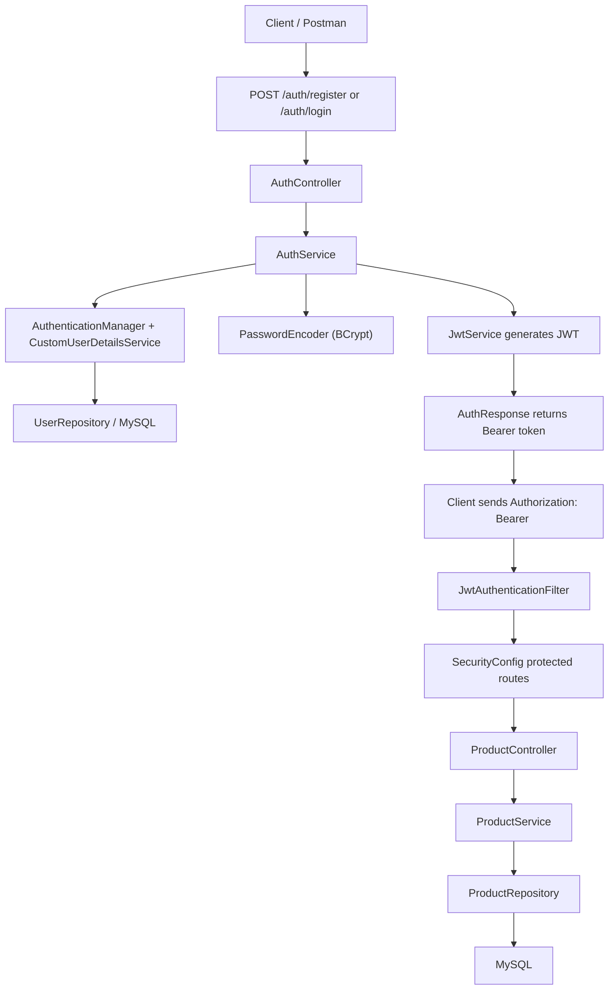

# Spring Boot Security, Docker, and Kubernetes Flow

Use this file as a quick interview revision sheet for how the whole project works end to end.

## Flow Diagram



## Security Flow

1. The client calls `/auth/register` or `/auth/login`.
2. `AuthController` forwards the request to `AuthService`.
3. During registration, the raw password is hashed with BCrypt before saving.
4. During login, `AuthenticationManager` verifies the credentials using `CustomUserDetailsService` and the stored BCrypt hash.
5. If authentication succeeds, `JwtService` creates a signed JWT token.
6. The client includes that JWT in the `Authorization` header for protected endpoints.
7. `JwtAuthenticationFilter` validates the token and sets the authenticated user in Spring Security.
8. Protected routes like `/products/**` are then allowed to continue to the controller/service/repository layers.

## Error Handling Flow

1. Validation errors, bad JSON, duplicate usernames, and not-found cases throw exceptions.
2. `GlobalExceptionHandler` catches them centrally.
3. The API returns a consistent payload:

```json
{
  "code": 400,
  "message": "Invalid request payload"
}
```

## Docker Flow

1. The `Dockerfile` uses a multi-stage build.
2. The builder stage runs `./gradlew clean test bootJar`.
3. The runtime stage copies only the final jar into a small Java 17 image.
4. Environment variables provide DB/JWT settings when the container starts.

## Kubernetes Flow

1. The `product-api` Deployment starts the Spring Boot container.
2. The `mysql` Deployment starts the MySQL container.
3. The `mysql` Service gives MySQL a stable DNS name inside the cluster.
4. `product-api` uses `jdbc:mysql://mysql:3306/productdb` to reach the DB.
5. ConfigMap and Secret inject runtime configuration into the app pod.
6. The `product-api` Service exposes the app inside the cluster, and `kubectl port-forward` makes it reachable locally.
